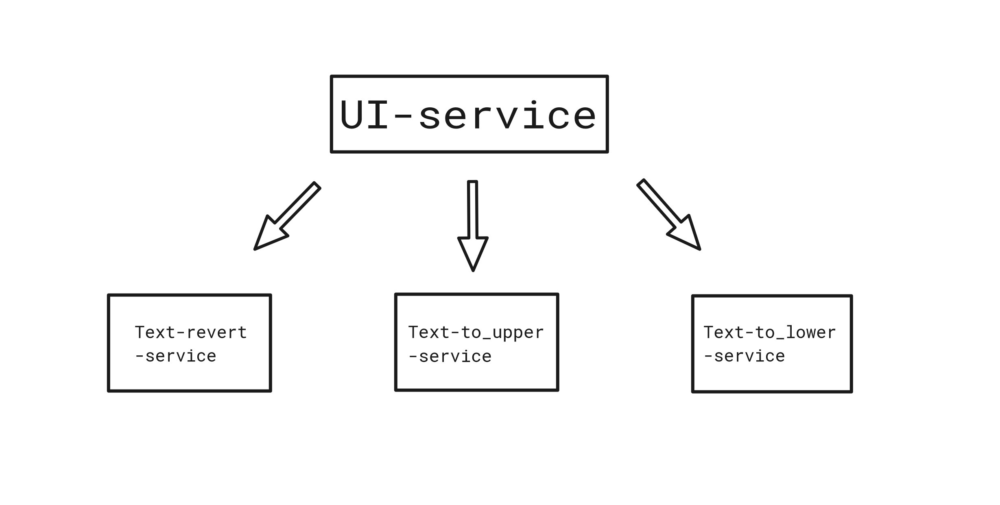
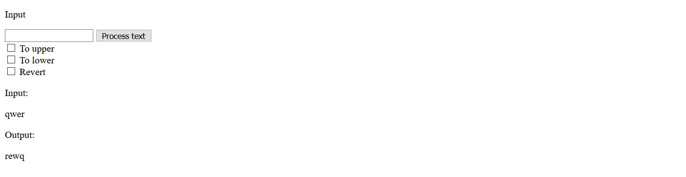

# microservice_application
The example microservice application that written with Flask and deployed with Docker-Compose

That project shows the example of a simple application written with a microservice architecture principle. 
Also, the repo contains a respective version of app that written in a monolithic style. 

### Details
The app represents a list of simple text operations such as make text upper or lower. Each text operation is executed by a separate service. 
The are 4 services:
* ui-service
* text-revert-service
* text-to_upper-service
* text-to_lower-service



### Run
In the simple_microservice_app folder:
```bash
docker-compose up
```

### Resulting app


